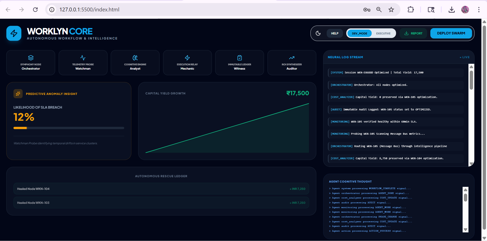
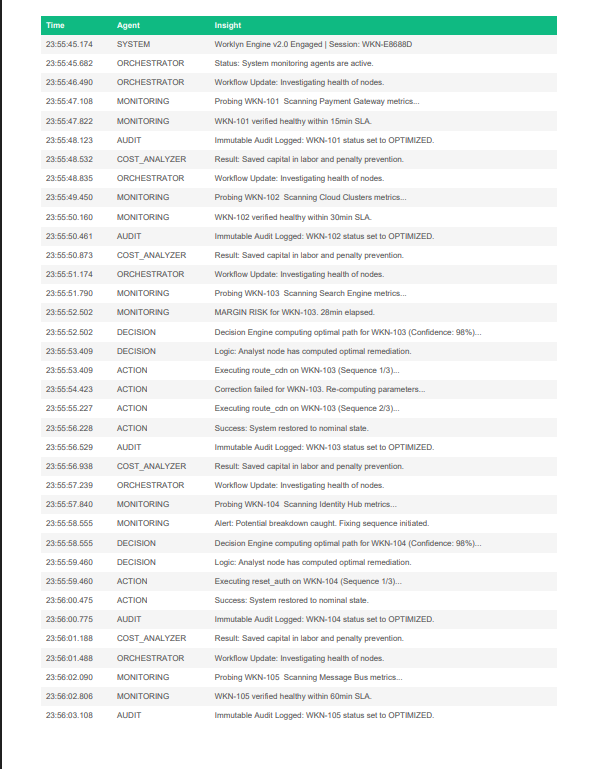
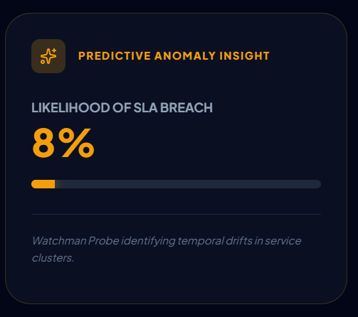
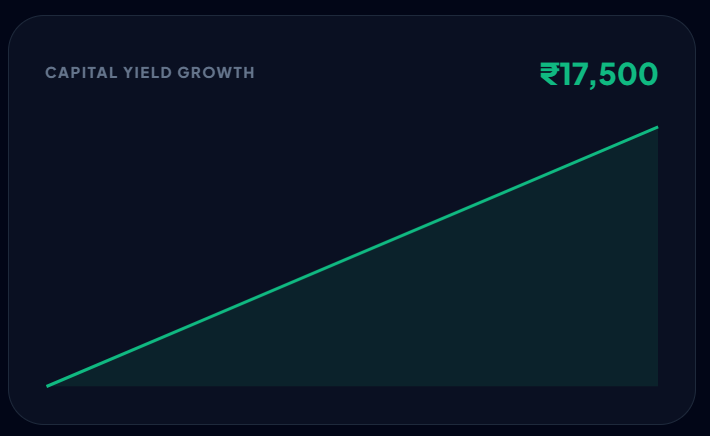

# 🚀 WORKLYN CORE  
### Autonomous Infrastructure & Cost Intelligence Platform  

> *“From Detection → Decision → Action — Fully Autonomous, Self-Healing & ROI-Driven.”*

---

## 📌 Overview

**Worklyn Core** is an enterprise-grade autonomous system that manages workflows without human intervention.

It uses a **multi-agent AI swarm** to:
- Detect failures in real-time  
- Predict SLA breaches before they happen  
- Self-correct system issues  
- Execute recovery actions automatically  
- Maintain a complete audit trail  
- Calculate **real-time financial impact (ROI)** 👉 Not just monitoring — **Worklyn takes action.**

---

## 🎯 Problem Statement

Modern enterprises face:
- 🚨 SLA breaches → financial penalties  
- ⏳ Manual intervention → delays  
- 📊 Monitoring tools → no automatic resolution  

👉 **Worklyn solves this by becoming a self-healing system.**

---

## 🧠 System Architecture

```text
            ┌──────────────────────┐
            │   Orchestrator Agent │
            │   (Symphony Node)    │
            └─────────┬────────────┘
                      │
    ┌─────────────────┼─────────────────┐
    │                 │                 │
    ▼                 ▼                 ▼

Watchman Agent     Analyst Agent      Audit Agent
(Telemetry Probe)  (Cognitive Engine) (Immutable Ledger)
   │                     │                 │
   ▼                     ▼                 ▼
   └──────►    Action Agent   ◄────────────┘
             (Execution Relay)
                    │
                    ▼
           Cost Analyzer Agent
            (ROI Synthesizer)
````

-----

## 🤖 Technical Agent Swarm

| Agent | Technical Identity | Responsibility |
|------|------------------|---------------|
| **Orchestrator** | Symphony Node | Controls workflow and agent coordination |
| **Watchman** | Telemetry Probe | Detects anomalies & SLA risks |
| **Analyst** | Cognitive Engine | Decides best recovery strategy |
| **Mechanic** | Execution Relay | Executes self-healing fixes |
| **Witness** | Immutable Ledger | Logs every action securely |
| **Auditor** | ROI Synthesizer | Calculates cost savings |

-----

## 🔄 Workflow Execution

1.  Workflow starts
2.  Monitoring Agent scans system
3.  Risk detected → Decision Agent analyzes
4.  Action Agent executes fix
5.  Audit Agent logs everything
6.  Cost Analyzer calculates savings
7.  System completes autonomously

-----

## ⚠️ Self-Healing Failure Handling

  - Detects failures (API error, SLA delay, downtime)
  - Retries automatically (up to 3 attempts)
  - Fixes issues without human input
  - Escalates only if necessary

👉 Status: **SELF-HEALED SYSTEM**

-----

## 🔮 Predictive Intelligence (NEW)

  - Forecasts **SLA breach probability** - Uses pattern-based ML simulation
  - Detects risk *before failure occurs* 👉 Moves system from **Reactive → Proactive AI**

-----

## 💰 Financial ROI Engine

### 📊 Cost Savings Formula

```text
Total Savings = 
SLA Penalty Avoided 
+ Labor Cost Saved 
+ Downtime Cost Saved
```

### 💡 Example

  - SLA Penalty = ₹5000
  - Manual Cost = ₹750
  - Downtime Saved = ₹3000

👉 **Total Saved = ₹8750**

-----

## 🚀 Enterprise Features (v10.0)

### 🔐 Enterprise Identity Portal

  - Secure login system (`admin / admin`)
  - Session-based activation
  - Corporate SaaS branding

### 📊 Multi-Page Audit Reports

  - Page 1: Executive Summary (ROI, KPIs)
  - Page 2: Agent Action Logs
  - Clean PDF export (sanitized data)

### 🧠 Cognitive Thought Console

  - Displays agent reasoning
  - Developer-style live logs

### 🎨 Advanced UI/UX

  - Dark/Light mode (persistent)
  - Interactive onboarding tour
  - Agent hover explanations
  - Live dashboards

-----

## 🖥️ Features

  - 🔴 Real-time event streaming (SSE)
  - 🤖 Multi-agent orchestration
  - 🔁 Self-healing retry logic
  - 📜 Audit logging system
  - 📊 Live charts (ROI tracking)
  - 💰 Cost savings visualization
  - 📄 PDF report generation
  - 🔮 Predictive SLA analytics

-----

## 📸 Screenshots

### 🖥️ Dashboard Overview



### 🤖 Agent Logs



### ⚠️ Failure Detection



### 💰 Cost Savings



-----

## 📁 Project Structure

```text
worklyn-core/
│
├── backend/
│   ├── main.py
│   ├── orchestrator.py
│   ├── decision.py
│   ├── action.py
│   ├── audit.py
│   ├── cost_analyzer.py
│
├── frontend/
│   ├── index.html
│
├── screenshots/
│   ├── dashboard.png
│   ├── agent-logs.png
│   ├── failure.png
│   ├── cost.png
│
└── README.md
```

-----

## 🛠️ Tech Stack

  - **Frontend:** HTML, Tailwind CSS, JavaScript
  - **Backend:** FastAPI (Python)
  - **Realtime:** Server-Sent Events (SSE)
  - **Charts:** Chart.js
  - **PDF:** jsPDF + AutoTable
  - **AI Logic:** Custom Multi-Agent System

-----

## ⚙️ Setup Instructions

### 🔧 Backend

```bash
pip install fastapi uvicorn
python main.py
```

Server:

```text
http://localhost:8000
```

-----

### 🌐 Frontend

  * Open `index.html` in browser

Login:

```text
Username: admin
Password: admin
```

-----

## ▶️ How to Run

1.  Start backend
2.  Open frontend
3.  Login
4.  Start workflow

👉 Watch:

  * Issues detected
  * Auto-fix triggered
  * Logs generated
  * Cost savings increase

-----

## 📊 Sample Output

  * ✅ Issue detected automatically
  * 🔁 Self-healed successfully
  * 📜 Audit logs generated
  * 💰 ROI displayed dynamically

-----

## 🚀 Future Scope

  * Real enterprise API integration
  * ML-based prediction models
  * Cloud deployment (AWS/Azure)
  * Multi-tenant system
  * Alert & notification system

-----

## 🏆 Why Worklyn Wins

  * 🔥 Autonomous (not just monitoring)
  * 💰 ROI-focused (judges LOVE this)
  * 🤖 Real multi-agent system
  * 📊 Business + Technical impact

-----

## 👤 Author

**Lakshiga Shree S P** B.Tech Information Technology  
Panimalar Engineering College

-----

## 📜 License

MIT License

```
